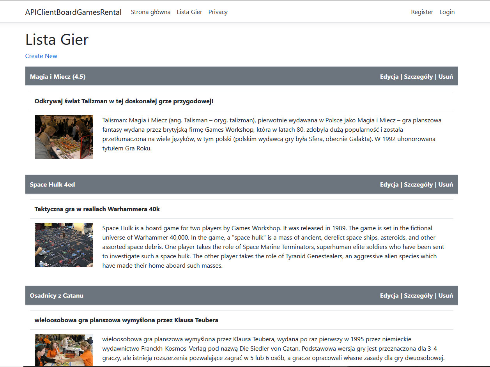

# APIClientBoardGamesRental
Wypozyczalnia gier planszowych. Praca w trakcie.
  
<b>Działa:</b>
<ul>
<ol>Klient łączy się z API i pobiera dane gier z wystawionego JSONa</ol>
<ol>Dodawanie nowych gier, modyfikowanie wpisów, wyświetlanie szczegółów, usuwanie wpisów. </ol>
</ul>
  

